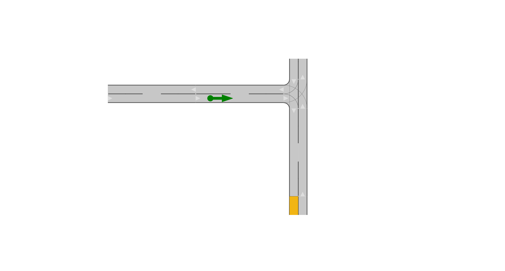
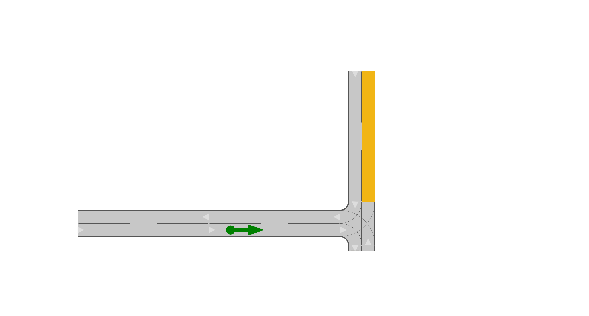

[](https://zenodo.org/doi/10.5281/zenodo.10634223)

[](https://www.linux.org/)
[](https://www.python.org/downloads/release/python-3100/) [](https://www.python.org/downloads/release/python-390/)


# 🚸 Occlusion-aware Trajectory Assessment 🚴


<details>
<summary> <h2> ℹ️ Basic Information </h2> </summary>

This repository contains the Frenetix-Occlusion module along with a test configuration setup. 
The primary objective of this module is to identify occluded road users, predict potential movements, 
and perform a trajectory safety assessment using a variety of criticality metrics. It is designed to enhance situational 
awareness and safety in complex driving environments by accurately assessing and mitigating risks associated with occluded areas.

In the provided scenario (using the predefined configuration), the vehicle initiates a deceleration before approaching the turn as a precautionary measure against potential hidden obstacles, such as a truck obscuring the view (proactive braking strategy). Upon sighting the cyclist, the vehicle further reduces its speed.

It's important to note that when the harm limitation is not applied (`harm: 1`), the vehicle enters the intersection without decelerating. Consequently, upon detecting the cyclist, the vehicle's speed is excessive, preventing it from braking in time to avoid a collision.

Please be aware that adjustments to the settings were necessary due to behavioral changes in the newer version of Frenetix. To replicate the results documented in our paper, refer to the **Resimulation** section of this README.

Regardless of the version of Frenetix used, it is consistently observed that the vehicle engages in braking before the actual obstacle comes into view.

</details>

<details>
<summary> <h2> 🔧 Requirements & Pre-installation Steps </h2> </summary>

### Requirements
The software is  developed and tested on recent versions of Linux. We strongly recommend to use [Ubuntu 22.04](https://ubuntu.com/download/desktop) or higher.
For the python installation, we suggest the usage of Virtual Environment with Python 3.10 or Python 3.9
For the development IDE we suggest [PyCharm](http://www.jetbrains.com/pycharm/).

To execute this example, we recommend using the [Frenetix Motion Planning Algorithm](https://github.com/TUM-AVS/Frenetix-Motion-Planner). 
An appropriate configuration is already included in this package.


### Pre-installation Steps
1. Make sure that the following **dependencies** are installed on your system for the C++ implementation of Frenetix:
   * [Eigen3](https://eigen.tuxfamily.org/dox/) 
     * On Ubuntu: `sudo apt-get install libeigen3-dev`
   * [Boost](https://www.boost.org/)
     * On Ubuntu: `sudo apt-get install libboost-all-dev`
   * [OpenMP](https://www.openmp.org/) 
     * On Ubuntu: `sudo apt-get install libomp-dev`
   * [python3.10-full](https://packages.ubuntu.com/jammy/python3.10-full) 
        * On Ubuntu: `sudo apt-get install python3.10-full` and `sudo apt-get install python3.10-dev`

2. **Clone** this repository & create a new virtual environment `python3.10 -m venv venv`

3. **Install** the package:
    * Source & Install the package via pip: `source venv/bin/activate` & `pip install .` or with [poetry](https://python-poetry.org/) `poetry install`
    * Everything should install automatically. If not please write [korbinian.moller@tum.de](mailto:korbinian.moller@tum.de).
4. **Optional**: Download additional Scenarios [here](https://gitlab.lrz.de/tum-cps/commonroad-scenarios.git)


</details>


<details>
<summary> <h2> 📋 Step-by-Step Instructions to execute Frenetix-Occlusion </h2> </summary>

To execute the main with an example Frenet Planning algorithm from [here](https://github.com/TUM-AVS/Frenetix-Motion-Planner), do the following steps: 

1. Install Frenetix-Motion-Planner with `pip install frenetix-motion-planner==2024.1.1`
2. **OPTIONAL:** Configure the Occlusion Module parameters or Planner settings in the `configurations` folder.
   * Parameters of Frenetix-Occlusion can be set in `simulation/occlusion.yaml`
       * activate/deactivate the Module (`use_occlusion_module: True`) 
       * activate/deactivate metrics (`activated_metrics`)
       * set metric thresholds for trajectory assessment (`metric_thresholds`)
       * configure the internal sensor model (`sensor_model`)
   * further parameters, e.g. costs can be adapted in the other `*.yaml` files

3. Select a scenario (default is an intersection where a left turn is performed)
4. Execute `python3 main.py` or use your IDE GUI
5. Other scenarios can be added and must be selected in [main.py](main.py) line 64
   - Please note: if you change the scenario, make sure to adapt or deactivate the **real agents** in the settings (`occlusion.yaml`)

**OPTIONAL:**
To incorporate custom obstacles into the scenario, this can be achieved by modifying the `simulation/occlusion.yaml` file under the `agents` section. 
To add a custom obstacle, you must specify its position, type, velocity, timestep, and horizon.
E.g.:

    agents:

        position: [16, 2.8]

        velocity: 8

        agent_type: "Truck"

        timestep: 0

        horizon: 5.0


</details>


<details>
<summary> <h2> 📈 Test Data </h2> </summary>

### Available Test-Scenarios
| Scenario                                                 | Description                                                                                                                               | Visualization                                              |
|----------------------------------------------------------|-------------------------------------------------------------------------------------------------------------------------------------------|------------------------------------------------------------|
| Scenario 1 - intersection left (configuration available) | Intersection scenario where the vehicle has to do a left turn. Additional road users can be placed in the scenario (see `occlusion.yaml`) |  |
| Scenario 2 - right turn                                  | Right turn with possible hidden pedestrian behind the turn. (currently not working due to commonroad-route-planner issues)                |  |
| Scenario 3 - left turn                                   | Left turn.                                                                                                                                |  |


Additional scenarios can be found [here](https://commonroad.in.tum.de/scenarios).

</details>

<details>
<summary> <h2> 💻 Resimulation of Paper Results (Expert Settings)</h2> </summary>

In the process of resimulating the results presented in the publication, it's important to note that the original results were obtained using a slightly different software version. 
As such, variations in the outcomes, especially concerning cost weights, are possible.

To accurately replicate the paper's findings, it is necessary to install Frenetix version 0.1.2. 
This involves first uninstalling the current package using the command:

`pip uninstall frenetix`

Subsequently, install Frenetix version 0.1.2 by running:

`pip install frenetix==0.1.2`

Additionally, a parameter within the Frenetix motion planner, which sets the collision probability costs, needs to be adjusted:
Change `line 151` of the file [reactive_planner_cpp.py](venv/lib/python3.10/site-packages/frenetix_motion_planner/reactive_planner_cpp.py) to:

`self.handler.add_cost_function(
                cf.CalculateCollisionProbabilityFast(name, self.cost_weights[name], self.predictionsForCpp, self.vehicle_params.length*2, self.vehicle_params.width*1.5))`

By adjusting these settings along with the cost weights provided in our paper, it is possible to resimulate the results demonstrated in the publication.

Cost weights used in the paper:

    cost_weights:
    acceleration: 0.0
    jerk: 0.00
    lateral_jerk: 1.0
    longitudinal_jerk: 1.0
    orientation_offset: 0.0
    path_length: 0.0

    lane_center_offset: 0.0
    velocity_offset: 0.1
    velocity: 0.
    distance_to_reference_path: 3.0
    distance_to_obstacles: 0.1

    prediction: 200
    responsibility: 0
</details>

<details>
<summary> <h2>  Known Issues </h2> </summary>

- Scenario 2 is currently non-functional owing to issues with the CommonRoad Route Planner, which is unable to generate a valid reference path for the right turn. 
This issue is anticipated to be resolved with the release of the upcoming version of the route planner.
- BE metric is only working with frenetix 0.1.2 (will be fixed)

Please report all other issues to [korbinian.moller@tum.de](mailto:korbinian.moller@tum.de).

</details>


<details>
<summary> <h2> 📇 Contact Info </h2> </summary>

[Korbinian Moller](mailto:korbinian.moller@tum.de),
Professorship Autonomous Vehicle Systems,
School of Engineering and Design,
Technical University of Munich,
85748 Garching,
Germany

[Rainer Trauth](mailto:rainer.trauth@tum.de),
Institute of Automotive Technology,
School of Engineering and Design,
Technical University of Munich,
85748 Garching,
Germany

[Johannes Betz](mailto:johannes.betz@tum.de),
Professorship Autonomous Vehicle Systems,
School of Engineering and Design,
Technical University of Munich,
85748 Garching,
Germany

</details>

<details>
<summary> <h2> 📃 Citation </h2> </summary>
   
If you use this repository for any academic work, please cite our code:
- [Occlusion-aware Planning](https://arxiv.org/abs/2402.01507)

```bibtex
@misc{moller2024overcoming,
      title={Overcoming Blind Spots: Occlusion Considerations for Improved Autonomous Driving Safety}, 
      author={Korbinian Moller and Rainer Trauth and Johannes Betz},
      year={2024},
      eprint={2402.01507},
      archivePrefix={arXiv},
      primaryClass={cs.RO}
}
```
</details>